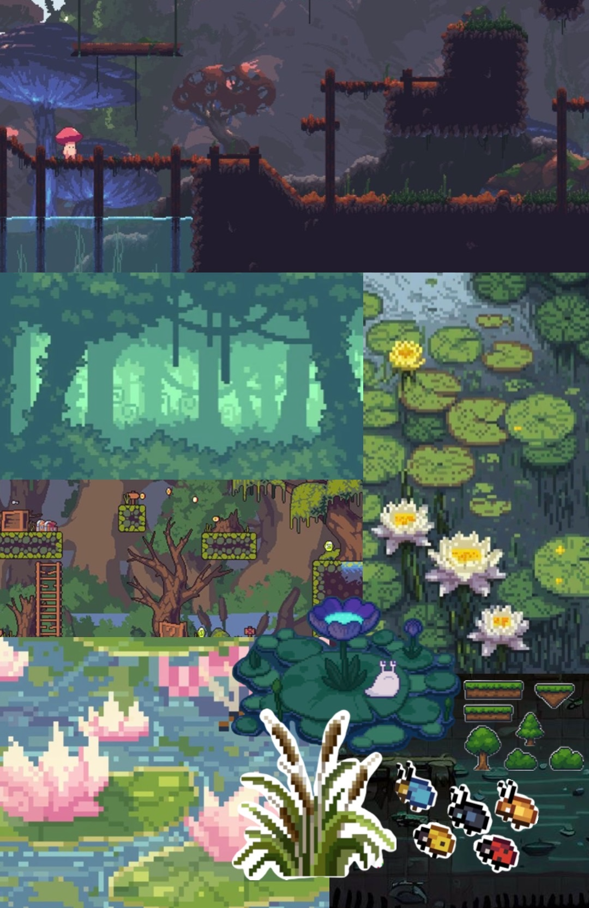
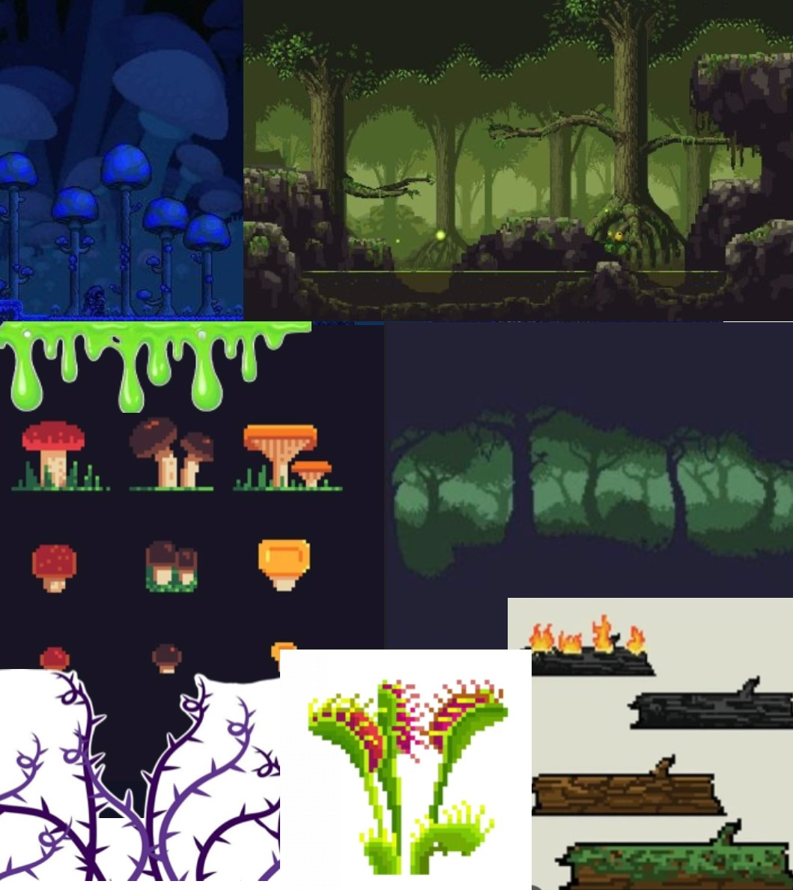

# **Anura**

## _Game Design Document_

---

##### **Copyright notice / author information / boring legal stuff nobody likes**

##
## _Index_

---

1. [Index](#index)
2. [Game Design](#game-design)
    1. [Summary](#summary)
    2. [Gameplay](#gameplay)
    3. [Mindset](#mindset)
3. [Technical](#technical)
    1. [Screens](#screens)
    2. [Controls](#controls)
    3. [Mechanics](#mechanics)
4. [Level Design](#level-design)
    1. [Themes](#themes)
        1. Ambience
        2. Objects
            1. Ambient
            2. Interactive
        3. Challenges
    2. [Game Flow](#game-flow)
5. [Development](#development)
    1. [Abstract Classes](#abstract-classes--components)
    2. [Derived Classes](#derived-classes--component-compositions)
6. [Graphics](#graphics)
    1. [Style Attributes](#style-attributes)
    2. [Graphics Needed](#graphics-needed)
7. [Sounds/Music](#soundsmusic)
    1. [Style Attributes](#style-attributes-1)
    2. [Sounds Needed](#sounds-needed)
    3. [Music Needed](#music-needed)
8. [Schedule](#schedule)

## _Game Design_

---

### **Summary**

A small frog fights its way up the food chain in a 2D roguelite fighting game set in a swamp. Players collect mosquitoes, build strategic card combinations, and defeat increasingly larger predator bosses to survive each run.

### **Gameplay**

What should the gameplay be like? What is the goal of the game, and what kind of obstacles are in the way? What tactics should the player use to overcome them?

The player controls a small frog moving through swamp areas filled with mosquitoes, obstacles, and boss encounters. Mosquitoes act as a currency and are collected using the frog's tongue while navigating platforming sections and preparing for fights.

Combat happens in 1v1 boss battles against animals higher in the food chain. Before each run, the player chooses a small set of power-up cards (3 cards to be exact), which the frog eats during combat to activate special abilities like speed boots, poison attacks, shields, or stronger jumps. Each boss has a unique attack pattern and weakness, encouraging players to experiment with different card combinations and strategies.

If the player dies, the run ends and the collected mosquitoes can be spent in the shop to unlock new cards or upgrades, making future runs stronger and allowing the player to progress in the game.

Roguelite Structure:

Anura follows a run-based progression system. Each run is self contained, and death resets the current attempt. However, collected mosquitoes function as persistent currency that can be spent in the shop to permanently unlock new cards.

This creates a classic roguelite loop:

- Attempt run
- Defeat bosses or die
- Earn currency
- Unlock stronger or more complex cards
- Start a new run with improved strategic options

### **Mindset**

What kind of mindset do you want to provoke in the player? Do you want them to feel powerful, or weak? Adventurous, or nervous? Hurried, or calm? How do you intend to provoke those emotions?

Anura is built around a strong emotional contrast between calmness and tension.

The main mindset can be summarized as:
“Small creature, big world, smart survival.”

At the beginning of each run, the player should feel vulnerable and cautious. The frog is small, visually cute and at a first glance quite fragile. When encountering the enemies they seem intimidating in size and presence to the player. This creates tension and a sense of danger.

Between boss encounters, platforming sections are designed to feel calm and cozy. The swamp environment is soft and atmospheric even though it still has some obstacles for the player. This peaceful exploration and obstacle course phase reinforces the feeling of safety.

However, this calm state is disrupted during boss fights and shifts the player's mentality from relaxed exploration and casual game to tension and alertness. 

As the player progresses, learns boss patterns, experiments with card combinations and purchases permanent upgrades, the mindset changes from trying to survive to dominating the game. 

The game aims to provoke:

- Strategic thinking (not just randomly smashing buttons)
- Tension during boss fights
- Experimentation through card combinations
- Satisfaction from defeating more dangerous bosses
- Resilience through the roguelite loop which would be "failure is progress"

Visually, the game supports this whole mindset through a blend of cute, cozy aesthetics and dangerous bosses. The intended emotional experience is for the player to think:

"I'm just a cute little frog in a peaceful swamp" right before facing a 1v1 boss fight that forces them to adapt and survive.

## _Technical_

---

### **Screens**

1. Title Screen

    The title screen sets the identity and tone of Anura

    Visually there's:
    The frog sitting peacefully on a lily pad
    Soft swamp ambience in the background
    The game title ANURA in big letters centered

    This screen transmits calmness and charm before the tension of the gameplay

    

    1. Options
    
        Accessible from the Title screen
        Includes:
        
        New game

        Continue Run (if available)
        
        Settings: audio, volume, music on/off (NOTA: SIENTO QUE NO ES TAN ESENCIAL PARA PROPOSITOS DEL PROYECTO POR LO TANTO UNICAMENTE SE DESARROLLARÁ SI HAY TIEMPO SUFICIENTE)
        
        Quit

        

2. Level Select -> Run Prep Screen

    The player selects 3 cards before starting a run
    The player can review unlocked cards
    The player can see base stats like health, damage, speed

3. Game
    1. Inventory
    2. Assessment / Next Level
4. End Credits

_(example)_

### **Controls**

How will the player interact with the game? Will they be able to choose the controls? What kind of in-game events are they going to be able to trigger, and how? (e.g. pressing buttons, opening doors, etc.)

The player interacts with the game through direct character control in a 2D side environment. The controls are designed to be simple, supporting fast reactions during boss fights while remaining comfortable throughout the platform sections.

#### **Basic Movement Controls**

- Walk to the right -> D button
- Walk to the left -> A button
- Crouch -> S button
- Jump -> spacebar
- Double jump (if unlocked) -> Press jump (space button) again mid air

#### **Combat controls**
- Basic attack (tongue strike) -> left click button
- Activate card 1 -> #1 button 
- Activate card 2 -> #2 button
- Activate card 3 -> #3 button

Cards are activated manually during combat

#### **Interaction with the environment**
Players can trigger in game events such as:

- Collecting mosquitoes by hitting them with the tongue
- Entering boss arenas by walking through doors or caves
- Navigating obstacles by jumping, dodging or using abilities

#### **Menu and system controls**

- Pause menu -> esc

### **Mechanics**

Are there any interesting mechanics? If so, how are you going to accomplish them? Physics, algorithms, etc.

Anura combines platforming, 1v1 boss combat, and a strategic card activation system within a roguelite progression loop. 

The following are the core mechanics and how they function at a systems level.

1. Tongue collection and attack system
    
    The frog uses its tongue as both a collection and combat mechanic. (tongue = weapon)
    
    - Mosquitoes are collected then the tongue collider overlaps with their hitbox.

    Defining how the currency (mosquitoes) will work:
    - Mosquitoes are collected then the tongue collider overlaps with their hitbox.

    La lengua tiene una caja invisible, el mosquito tiene otra caja invisible, las dos cajas se tocan, el mosquito desaparece y se incrementa el contador de monedas disponibles

    - The tongue acts as a short range directional attack, it will funcion as a fast meele hitbox in front of the frog.

    need: collision detection system for mosquito collection, hitbox activation during attack animation frames, cooldown timer to prevent spamming.

    La lengua hace daño en corto alcance hacia donde se este mirando, el ataque sera meele, es decir golpe corto, rapido, no viaja lejos

    - In terms of physics, we want to implement the movement of the tongue attack as a MRU movement that will stop at a short distance and will always move in “x” direction, we also want to assign these attack the hitpoints that will deal to the boss

    - Moving to the spit attack, we want to implement it the same way as the melee attack but the only thing is this movement will not have a limit in distance and it will only stop if it hits the enemy or if its surpasses the frame of what you see in the screen

    - Also we need to implement a cooldown on these attacks so it doesn’t become a spam and break the game.

    Movement: The character will have 3 types of movement: the regular running (since its 2D it can move sideways only), jumping and a dash.

    - Running will be the basic constant movement that the character will have, we will define a certain velocity that fits the pace of the game and it will specifically move in the x axis only. The keybinds “a” (left)  and “d” (right) will be the keys that trigger the move

    - Its also defined as a MRU movement only the x axis

    - The jump mechanic will be attached to the space bar key and will function a bit more complex than the other mechanics, it will work as a parabolic movement so this means it works as a MRUA and will have an initial velocity in “y” that's a predetermined velocity attached to the space bar and also an initial velocity in “x” that will be attached to the running mechanic. (Esta parte del salto está un poco difícil de implementar pero hay q ir viendo)

    - Finally the dash will be a movement that will have cooldowns so it can't be spammed and it will be a faster movement in “x” axis that will give invulnerability to the player (podemos cambiar eso) and this dash will have a limited distance reached.

2. Card System

    Cards are activated by selecting them during combat

    Mechanically:

    - The player has a deck of 3 equipped cards:
        
        - Pressing the assigned key to the card slot triggers a shiny border around the selected card, each card has a cooldown, effecto modifier.

    Card activation logic

    Each card functions as an ability object with:

    - cooldown timer
    - effect value (damage, shield, speed modifier, etc)
    - activation condition
    - optional synergy interaction

    Cards are stored in a structured array representing the player's active build:

    playerDeck = [card1, card2, card3]

    When a key (1, 2, 3) is pressed:

    - the system checks if cooldown <= 0
    - if true -> applies the card effect
    - cooldown resets
    - visual feeback is triggered

    Strategic component
    
    Although the player only equips 3 cards per run, the full collection of unlocked cards creates build diversity. Different combinations lead to different playstyles (aggressive, defensive, sustain based, mobility focused)

    This limited deck size reinforces strategic pre run decision making, aligning with TCG design principles.

    NOTES:

    CARDS ARE OBJECTS WITH PROPERTIES
    
    THERE'S COOLDOWN

    POSSIBLE SINERGY

    Sinergy: synergistic deck is one where every card benefits from every other card 

3. Boss pattern system

    Boss behavior is driven by structured pattern based logic, implemented through *state management* in JavaScript.

    Each boss operates using a *Finite State Machine (FSM) model. This means the boss can only be in one state at a time, and it transitions between states based on predefined conditions such as timers, player distance or remaining health.

    Example boss states:

    - Idle - the boss waits or prepares an attack.
    - Attack - the boss performs a specific attack animation and activates its hitbox.
    - Recovery - a short vulnerability window afer attacking
    - Phase 2 - activated when health drops below a certain threshold (ex. 50% can vary)

    State transitions are controlled using conditional logic an timers. For example:

    - Afer a certain time in idle -> transition to attack
    - After Attack completes -> transition to recovery
    - When health is below or 50% -> activate phase 2 behavior

    This system ensures predictable but challenging encounters, reinforcing pattern recognition and startegic gameplay instead of complete randomness.

    Since the game is built using HTML and JS mechanics are implemented using:

    - Game loop logic (e.g., requestAnimationFrame)

    - Collision detection systems (hitboxes and bounding boxes)

    - State variables

    - Timers and cooldown counters

    - Health threshold checks

    ----------------------------------------------

    logica programada con estados

    necesitamos un sistema de estados (state machine), es decir pura logica con if, variables y temporizadores.

    un boss pattern system es:

    el boss tiene un estado actual ya sea idle, attacking, recovering, etc, y se cambia ese estado dependiendo del tiempo o la vida, se implementara de la siguiente forma:

## _Level Design_

#### Game Flow

**Run Flow**
1. Title Screen
2. Card Selection (Run Prep) 
3. Platform Section
4. Boss Fight
5. Reward / Death
6. Shop (unlock cards) **Only if we have enough time**
7. New Run

---

_(Note : These sections can safely be skipped if they&#39;re not relevant, or you&#39;d rather go about it another way. For most games, at least one of them should be useful. But I&#39;ll understand if you don&#39;t want to use them. It&#39;ll only hurt my feelings a little bit.)_

### **Themes**

1. Swamp Surface (Initial Zone)
    1. Mood
        1. Calm, humid, cozy, slightly tense, natural and alive
    2. Objects
        1. _Ambient_
            1. Fireflies
            2. lily pads floating
            3. Swamp cane (reeds)
            4. Soft water reflections
            5. Tiny flying insects
            6. Swamp fauna

        2. _Interactive_
            1. Mosquitoes (coin)
            2. Shallow water pools
            3. Mud and moss platforms
            4. Floating logs
            4. boss arena entrance (possibly a cave)

        

2. Dense Swamp (mid game zone): this area reflects progression, the frog is no longer in a safe space, the environment starts to feel more hostile.

    1. Mood
        1. Darker, more enclosed, slightly oppressive, more dangerous, less visually open
    2. Objects
        1. _Ambient_
            1. Thick tree trunks
            2. Large exposed roots
            3. Light mist or fod
            4. Glowing mushrooms
            5. distant predator sounds
        2. _Interactive_
            1. Narrow platforms
            2. Thorny plants (Damage on contact)
            3. Deep water (slows movement)
            2. Unstable logs
            3. MAYBE MINOR ENEMIES (aggressive insects)

            

3. Predator Arena (boss zone)

    1. Mood
        1. Tense, focused, quiet before combat, isolated
    2. Objects
        1. _Ambient_
            1. broken vegetations
            2. bone fragments
            3. Darker water
            4. Heavy shadows
        2. _Interactive_
            1. Boss entity
            2. Arena boundaries (invisible walls or natural barriers)
            3. Terrain elements that influence movement (roots, shallow/deep patches)

         en el 3. roots -> serian como raices que sobresalen del suelo, pueden bloquear el paso, hacer que el jugador tenga que saltar, etc y las shallow deep patches son zonas de agua que reduzcan la velocidad, mas dificil esquivar ataques, etc
    
    Gameplay purpose
    - 1v1 confrontation
    - pattern recognition
    - card strategy execution
    - shift from calm to danger
    - smart survival

        
        
_(example)_

### **Game Flow**

**Run Flow**
1. Title screen
2. Hub (if player previously died)
3. Card selection (run prep)
4. Platform section 1
5. Boss 1
6. Platform section 2 (increased difficulty)
7. Boss 2
8. Platform Section 3 (increased difficulty)
9. Final Boss
10. Victory Screen

If the player dies at any point during the run:

- The run ends immediately
- The player respawns in the Hub
- The Shop becomes available
- The player may unlock new cards
- The player starts a new run

#### Level Structure

The game uses environmental teaching instead of explicit tutorials

Mechanics are introduced naturally:
- Early mosquito placement encourages tongue usage
- Small gaps teach jumping
- Moving platforms teach timing
- Boss teaches pattern recognition

#### Difficulty progression

Boss 1
- Simple attack pattern
- Clear visual signal before excecuting the attack
- Long recovery window

Boss 2 
- Faster attacks
- Shorter recovery window
- Requires better positioning

Boss 3
- Multiple phases
- Combined attack patterns
- Higher tension

Platform sections between bosses gradually increase in:

- Obstacle density
- Precision requirements
- Environmental hazards

The difficulty escalates without introducing entirely new mechanics late in the run. Instead it demands mastery of the existing systems.

#### Hub Structure (post death area)
The hub is a safe, calm area only accessible after death

It contains:
- Shop (permanent card unlocks)
- Card inventory view
- Option to start a new run
This is only if we could do it, if not we're gonna skip this part and make the cards appear in drops

## _Development_

---

### **Abstract Classes / Components**

1. BasePhysics
    1. BasePlayer
    2. BaseEnemy
    3. BaseObject
2. BaseObstacle
3. BaseInteractable

_(example)_

### **Derived Classes / Component Compositions**

1. BasePlayer
    1. PlayerMain(Frog)
2. BaseEnemy
    1. EnemyMosquitoes
    2. Enemyspider
    3. EnemySnake
    4. EnemyBoss1
    5. EnemyBoss2
    6. EnemyFinalBoss
    
3. BaseObject
    1. ObjectCard(Makes a screen for card Selection)
    2. ObjectChest (pick-up-able)
4. BaseObstacle
    1. ObstacleSpike
    2. ObstacleWall
    3. ObstaclePlatform
5. BaseInteractable
    1. InteractableButton
    2. InteractableCards
    3. InteractableCardspot   

_(example)_

## _Graphics_

---

### **Style Attributes**

The visual identity of Anura relies on a high-contrast color palette that reinforces the dual nature of the swamp. For the exploration phases, we will use a "Surface Swamp" palette consisting of mossy greens, earthy browns, and soft turquoise to evoke a calm, humid, and cozy atmosphere. However, as the player enters "Predator Zones," the colors will shift toward saturated deep purples and dark greys to immediately signal danger and heighten tension. By using a limited 16-bit color palette, we ensure that interactive elements remain distinct from the background, maintaining visual clarity even during chaotic boss fights.

The art direction follows a detailed pixel-art aesthetic characterized as "Cute but Deadly." The protagonist, Anura, and the ambient insects will feature soft outlines and rounded shapes to appear charming and vulnerable. In contrast, the predators and bosses will be designed with sharper angles, heavy shadows, and intimidating proportions to establish them as clear threats. To make the world feel alive, we will implement environmental particles such as subtle fireflies and floating lily pads.

Visual feedback is our primary tool for teaching mechanics without lengthy tutorials. To indicate interactivity, mosquitoes will look with a subtle white outline. When a card is activated, Anura will emit a light. During combat, we will use "Flash on Hit" effects and camera shakes to provide tactile weight to every strike, ensuring the player feels the impact of both their successes and their mistakes.

### **Graphics Needed**

1. Characters
    1. Anura Principal Character
    2. Bosses
        - Snake
        - Hawk
        - Fox (Can change to 2)
    3. Enemies
        - Slimes
        - Spiders
        - Mosquitoes
2. Environment & Blocks

Tilesets for mud, moss-covered platforms, climbing roots, and hollow logs that serve as transitions between platforming sections and boss arenas.

3. UI & HUD Elements

A clean interface featuring a mosquito counter, a health bar for the frog, and three distinct card slots with a visual overlay to indicate cooldown progress.

_(example)_

## _Sounds/Music_

---

### **Style Attributes**

Again, consistency is key. Define that consistency here. What kind of instruments do you want to use in your music? Any particular tempo, key? Influences, genre? Mood?

Stylistically, what kind of sound effects are you looking for? Do you want to exaggerate actions with lengthy, cartoony sounds (e.g. mario&#39;s jump), or use just enough to let the player know something happened (e.g. mega man&#39;s landing)? Going for realism? You can use the music style as a bit of a reference too.

 Remember, auditory feedback should stand out from the music and other sound effects so the player hears it well. Volume, panning, and frequency/pitch are all important aspects to consider in both music _and_ sounds - so plan accordingly!

### **Sounds Needed**

1. Player Effects
        - Wet Step: A squelching sound for walking on mud or moss.
        - Tongue Flick: A fast "thwip" sound for the melee attack.
        - Card Gulp: A satisfying "glug" or eating sound when a card is activated.
        - Dash: A sharp "whoosh" of air to indicate rapid movement.

2. Environmental & Feedback
        - Mosquito Pop: A light, high-pitched "ding" or "pop" upon collection.
        - Water Splash: Different sounds for jumping into shallow vs. deep water.
        - Boss Roar: Low-frequency growls or screeched signals before a boss attacks.
        - Death Croak: A sad, brief vocalization when a run ends.

2. Feedback
    1. Relieved &quot;Ahhhh!&quot; (health)
    2. Shocked &quot;Ooomph!&quot; (attacked)
    3. Happy chime (extra life)
    4. Sad chime (died)

_(example)_

### **Music Needed**

 

_(example)_

## _Schedule_

---

_(define the main activities and the expected dates when they should be finished. This is only a reference, and can change as the project is developed)_

1. develop base classes
    1. base entity
        1. base player
        2. base enemy
        3. base block
  2. base app state
        1. game world
        2. menu world
2. develop player and basic block classes
    1. physics / collisions
3. find some smooth controls/physics
4. develop other derived classes
    1. blocks
        1. moving
        2. falling
        3. breaking
        4. cloud
    2. enemies
        1. soldier
        2. rat
        3. etc.
5. design levels
    1. introduce motion/jumping
    2. introduce throwing
    3. mind the pacing, let the player play between lessons
6. design sounds
7. design music

_(example)_

_Options_

---

We are considering two distinct approaches for our card mechanics:

The Shop & Inventory System: Players earn "Mosquitoes" (in-game currency) and spend them in a dedicated shop to purchase specific cards. These cards provide strategic advantages during the adventure. This system includes an Inventory Management mechanic where players manually organize and equip their deck.

The Drop & Round-Based System: A more streamlined approach where cards are acquired via enemy drops or at the end of specific rounds. Players are presented with random card choices and must decide on the spot whether to equip a card to a specific slot or skip it to optimize their current run.
