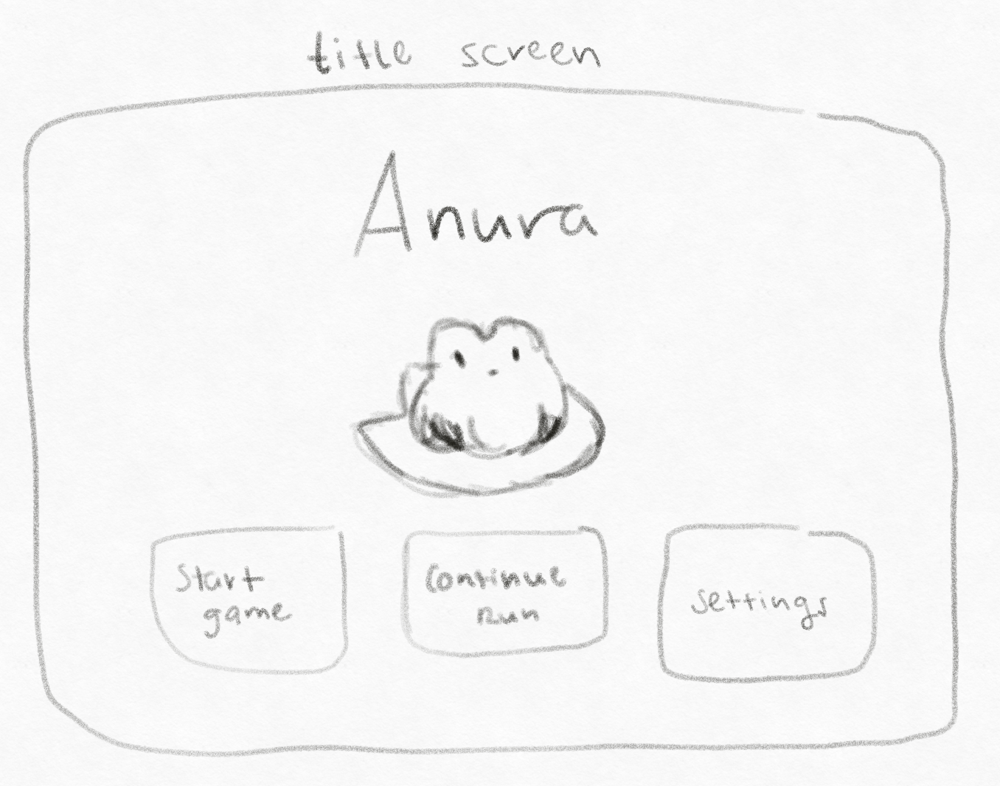
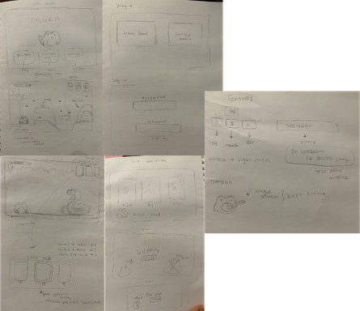
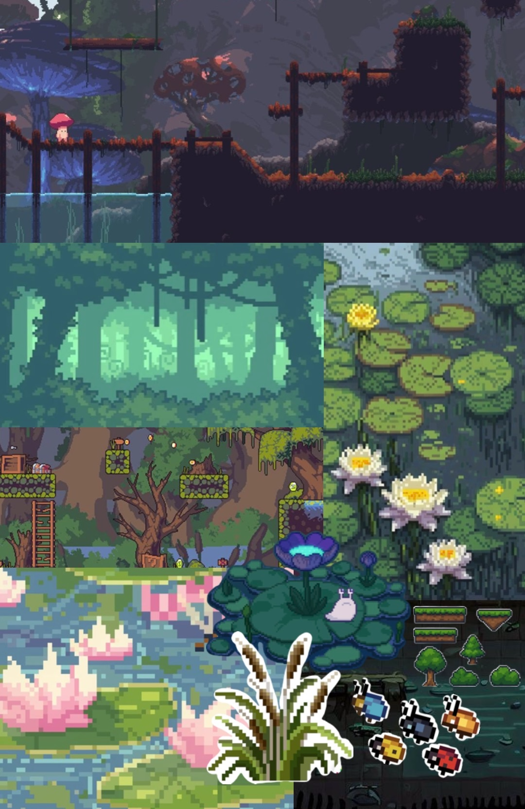
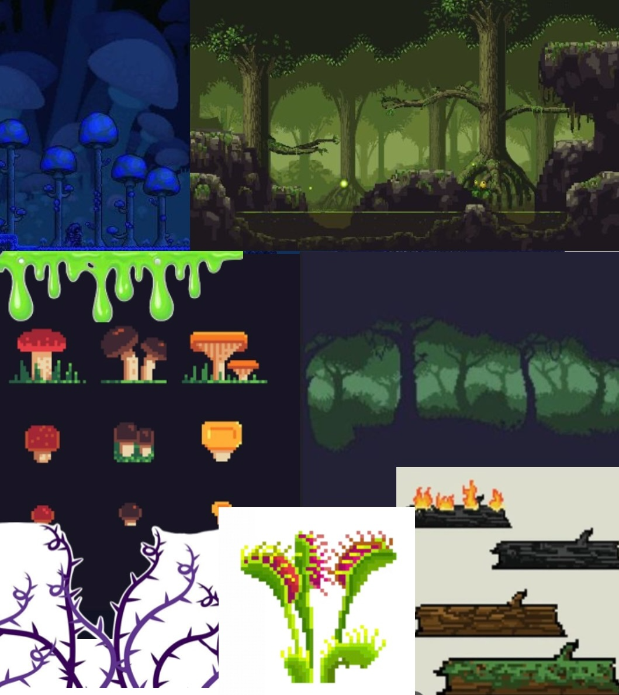
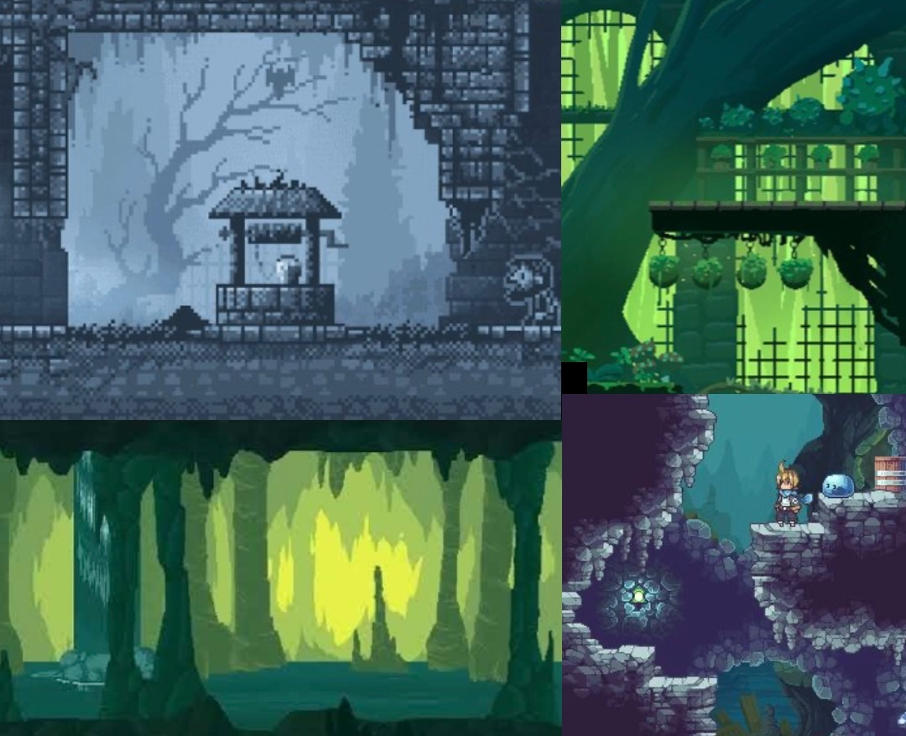

# **Anura**

## _Game Design Document_

---

##### **Copyright notice / author information**

## _Authors_
* Carlos Enrique Rosete Pascual
* Emilio Torres Castillo
* Renata Uruchurtu Ransom

## _Index_

---

1. [Index](#index)
2. [Game Design](#game-design)
    1. [Summary](#summary)
    2. [Gameplay](#gameplay)
    3. [Mindset](#mindset)
3. [Technical](#technical)
    1. [Screens](#screens)
    2. [Controls](#controls)
    3. [Mechanics](#mechanics)
4. [Level Design](#level-design)
    1. [Themes](#themes)
    2. [Game Flow](#game-flow)
5. [Development](#development)
    1. [Core Classes](#core-classes)
6. [Graphics](#graphics)
    1. [Style Attributes](#style-attributes)
    2. [Graphics Implemented](#graphics-implemented)
7. [Card System](#card-system)


---

## _Game Design_

---


### **Summary**

Anura is a **2D roguelite platformer** set in a dangerous swamp. The player controls a small frog fighting its way up the food chain, collecting mosquitoes as persistent currency, building a strategic 3 card deck across runs, and defeating increasingly threatening predator bosses to complete a run.

The game is built in **HTML/JavaScript** using a canvas-based game loop.

**What we used:**
- **Frontend:** HTML/JavaScript
- **Backend:** Node.js/Express API
- **Database:** MySQL
- **Architecture:** Database driven design for future expansion


---

### **Gameplay**

The player controls a small frog moving through swamp areas filled with mosquitoes (currency) and spider enemies (obstacles). Mosquitoes are collected using the frog's tongue attack while navigating platforms and avoiding damage.
 
**Combat Structure:**  
After completing a platforming section, the player enters a boss arena for a 1v1 battle against a predator with unique attack patterns. Each boss uses a Finite State Machine with distinct phases and attack patterns, requiring pattern recognition and strategic card use.

**Roguelite Loop:**  
The player begins their first run with 0 cards and no mosquito currency. Upon dying, a **Card Selection Screen** appears showing 3 random cards from the full pool of 15. The player may purchase at most **1 card per death** using their accumulated mosquitoes, or skip the selection to save currency. Cards accumulate in the deck across runs until activated and burned.

**Run Structure:**  
Each run follows a fixed sequence:
1. Platform Section 1
2. Snake Boss
3. Platform Section 2
4. Eagle Boss (Final)
5. Victory

Death at any point saves progress (mosquitoes + unburned cards) and returns to the Card Selection Screen.

---

### **Mindset**
 
Anura is built around a strong emotional contrast between calmness and tension.
 
The main player experience can be summarized as:
“Small creature, big world, smart survival.”

**Vulnerability and Caution:**
At the beginning of each run, the player should feel small and vulnerable. The frog is visually cute and appears fragile compared to the intimidating predators it must face. This creates tension and a sense of danger.
 
**Peaceful Explorations**
Between boss encounters, platforming sections are designed to feel calm and atmospheric. The swamp environment is soft, cozy, and non-threatening during exploration, reinforcing a feeling of safety before the next boss fight.
 
**Combat Intensity:**
Boss fights disrupt the calm state and shift the player's mentality from relaxed exploration and casual game to tension and alertness.

**
 
As the player progresses, learns boss patterns, experiments with card combinations and purchases permanent upgrades, the mindset changes from trying to survive to dominating the game. 
 
**Main Game Emotions:**
 
- Strategic thinking (deck building, resource management)
- Tension during boss fights (pattern recognition, precise timing)
- Experimentation through card combinations
- Satisfaction from defeating more dangerous bosses
- Resilience through the roguelite loop which would be ("failure is progress")
 
The intended emotional experience is for the player to think:
 
"I'm just a cute little frog in a peaceful swamp" right before facing a 1v1 boss fight that forces them to adapt and survive.


## _Technical_

---

### **Screens**

#### 1. **Title Screen**

The title screen sets the identity and tone of Anura. It presents different options depending on login status:

**When Logged Out:**
- Log In: Allows the user to log in with their credentials so their data is saved in the database
- Settings: Adjust brightness and volume

**When Logged In:**
- Start Run: Begins a new run attempt. Loads player's saved deck and mosquito count from database
- Log Out: Logs out and returns to the logged-out title screen
- Settings: Adjust brightness and volume

Visually there's:
The frog sitting peacefully on a lily pad
Soft swamp ambience in the background
The game title ANURA in big letters centered

This screen transmits calmness and charm before the tension of the gameplay





**Note:** There is no "New Game" button. To fully reset progress (wipe deck and mosquitoes), a player must create a new account. 
 
---

#### 2. **Card Selection Screen**
 
This screen appears **exclusively after death**. It manages deck building and the transition to the next run attempt.

**Visual Layout:**
- Displays current mosquito count
- Shows 3 randomly selected cards with name, description, cost, and card image
- "Buy" button for each card (if affordable), "Skip" button to proceed without purchasing
- Then a "Deck Preview Screen" that shows all cards currently in the deck, organized by category (Movement, Combat, Utility)

**Interaction Flow:**
1. Player sees 3 random cards from the full pool of 15
2. Player may purchase **at most 1 card** if they have enough mosquitoes
3. A deck preview scene is shown
4. Purchased card is immediately added to the deck and saved to database
5. "Start Run" button appears after purchase decision is made
6. Starting a new run loads the updated deck from database


*Strategic Note: Since cards are now consumable and randomly replaced from the pool, the selection screen is the primary way to "load up" on resources before facing the platforming sections and Bosses.*

---
 
#### 3. **Play Scene (Game HUD)**
 
The main gameplay screen where platforming and combat take place.
 
**HUD Elements:**
- Health Bar: Displays current health / max health
- Mosquito Counter: Shows mosquitoes collected in the current run 
- Card Slots (3): Visual display of active cards in slots 1, 2, 3 with card images and names
  - Slot 1 (Movement) - activated with key **1**
  - Slot 2 (Combat) - activated with key **2**
  - Slot 3 (Utility) - activated with key **3**
  - Active card highlighted in green, red, and yellow depending on the type
  - Reserve cards are shown until the player burns the current top card
- Damage Numbers: Floating combat text appears when enemies are hit

**Visual Feedback:**
- Flash effect when card is burned and replaced
- Invincibility frames make frog semi-transparent after taking damage

---

#### 4. **Pause Menu**
 
Accessed by pressing **Esc** during gameplay. Stops all game logic and timers.
 
**Options:**
- Resume: Returns to gameplay, unpauses timer
- Settings: Settings: Adjust brightness and volume
- Back to Menu: Returns to title screen

**Note:** Pausing doesn´t save run progress. Only death or victory saves to database.
 
---
 
#### 5. **Game Over Screen**
 
Appears when the frog's health reaches 0.
 
**Display:**
- "GAME OVER" message
- "Card Selection Screen in 3 seconds... " message which takes you to the Card Selection Screen

**Backend Behavior:**  
`saveProgress()` function is called, which triggers the `/run/death` endpoint. This saves:
- Mosquitoes collected in this run
- Cards remaining in deck (unburned cards persist)
- Run end time
- Victory status = false

---
 
#### 6. **Victory Screen**
 
Appears when the final boss (Eagle) is defeated.
 
**Display:**
- "SWAMP CLEARED!" message
- "You've conquered the food chain!" message
- "All predators defeated." message
- Total mosquitoes collected
- Back to title button

**Backend Behavior:**  
`saveProgress(true)` is called (true = victory), which saves the run with `victory = 1` and sets the run end time with the `set_end_time_on_victory` trigger.
 
---
 
### **Controls**
 
The player interacts with the game through direct character control in a 2D side-scrolling environment. Controls are simple and support fast reactions during boss fights while remaining comfortable during platforming sections.

#### **Basic Movement**
- Walk Left: A key
- Walk Right: D key  
- Aim Up: W key (aims tongue upward)
- Jump: Spacebar
- Double Jump / Triple Jump: Spacebar (mid-air, if unlocked via cards)
- Glide: I key (if unlocked via Glide Membrane card)
- Dash: J key (if unlocked via Bubble Dash card)

#### **Combat**
- Tongue Attack: Left Click (short-range melee hitbox in front of frog)

#### **Card Activation**
- Slot 1 (Movement): 1 key
- Slot 2 (Combat): 2 key
- Slot 3 (Utility): 3 key

**Important:** Each slot can have one active card at a time. You can have all three slots active simultaneously (1 Movement + 1 Combat + 1 Utility). Pressing a slot key applies that card's effect, burns it, and replaces it with the next card from that category's reserve pool.

#### **System**
- Pause: Esc key
- Interact: Walk into cave entrance or exit door to trigger the next scene

---

### **Mechanics**
 
Anura combines platforming, 1v1 boss combat, and a strategic card activation system within a roguelite progression loop. 
 
---
 
#### **1. Tongue Collection & Attack System**
 
The frog's tongue serves as both a collection tool and a combat weapon.

**Collection:**
- Mosquitoes have hitboxes. When the tongue collider overlaps a mosquito's hitbox, the mosquito is collected and the counter increments.
- Collected mosquitoes are saved to the database at the end of each run.

**Combat:**
- The tongue is a short-range directional melee attack with a hitbox that extends in front of the frog.
- Tongue damage is applied to enemies on collision.
- Tongue has a cooldown timer to prevent spam attacks.
- Tongue can be enhanced by Combat cards (Fire Kiss, Thunder Tongue, Venom Lash, etc.)
    
**Implementation:**
- Collision detection system checks for hitbox overlap between tongue and enemies/mosquitoes
- Attack animation triggers on left-click with cooldown
- Damage is dealt based on `frog.tongueDamage` property (modifiable by cards)

---
 
#### **2. Card System**
 
The card system revolves around three active slots, each assigned to a specific category. Players can accumulate an unlimited number of cards in their deck, which cycle through these slots dynamically.

**Core Mechanics:**

**Slot System:**  
Cards are activated by pressing their assigned key (1, 2, or 3) Each slot is dedicated to a specific category:
- Slot 1: Movement cards
- Slot 2: Combat cards
- Slot 3: Utility cards

**The Deck:**  
Players accumulate cards across runs. Cards are organized into three category specific arrays:

```
deck = {
    slot1_Movement:  [activeCard, reservedCard, reservedCard, ...],
    slot2_Combat:    [activeCard, reservedCard, reservedCard, ...],
    slot3_Utility:   [activeCard, reservedCard, reservedCard, ...]
}
```

**Burn & Replace:**  
- Cards are single-use. When activated , the card is "burned" and permanently removed from the deck for that run.
- Immediately after burning, a card from the same category's reserve pool is moved to the active slot.
- Card effects persist until the next card in THAT SLOT is activated (burn-and-replace), NOT on a timer.
- You can have up to 3 cards active simultaneously, one from each slot.

**Effect Application:**  
Each card has:
- `effectParameter`: The frog property to modify (`extraJumps`, `canGlide`, `tongueDamage`)
- `effectValue`: The value to apply (`1`, `10`, `1.5`)
- `.effect()`: Method that applies the card's ability to the frog
- `.reset()`: Method that reverts the frog to base stats before applying a new card

**Database Integration:**  
- All 15 cards live in the database
- Your deck is saved to your account
- When you start a run, your saved cards load automatically
- Adding new cards only requires updating the database, not the code


**Strategic Gameplay:**  
Cards are single-use and burned when activated, so players must:
- Decide when to use powerful cards
- Build a balanced deck across all 3 categories (Movement, Combat, Utility)

---

#### **3. Boss Pattern System**

Bosses use Finite State Machines (FSM), they switch between different behaviors (states) based on conditions like timers, distance to player, or remaining health.

**FSM Model:**  
Boss behavior is driven by structured pattern based logic, implemented through *state management* in JavaScript.
 
Each boss operates using a *Finite State Machine (FSM) model. This means the boss can only be in one state at a time, and it transitions between states based on predefined conditions such as timers, player distance or remaining health.
 
**Example Boss States:**
 
- IDLE - the boss waits or prepares an attack.
- ATTACK - the boss performs a specific attack animation and activates its hitbox.
- RECOVERY - a short vulnerability window afer attacking
- PHASE 2 - activated when health drops below a certain threshold (ex. 50% can vary)
 
State transitions are controlled using conditional logic an timers. 

**Snake Boss State Flow:**

1. IDLE -> Waits and observes the player
2. CHASE -> If player is within range (300 pixels), moves toward them
3. DASH -> Lunges at the player with increased speed
4. RETREAT -> Backs away after attacking (recovery window)
5. ENRAGED -> If health drops below 25%, enters permanent aggressive mode (faster, more dangerous)
6. STUNNED -> Temporarily disabled after taking massive damage

**Triggers:**
- Distance-based: Player within 300-pixel range -> switch from IDLE to CHASE
- Health-based: HP < 25% -> enter ENRAGED state (permanent until defeated)
- Damage-based: Taking high damage -> temporarily STUNNED
- Timer-based: After DASH completes -> transition to RETREAT (cooldown period)

**Eagle Boss State Flow:**

1. HOVER -> Flies above the arena, circling the player
2. DIVE -> Swoops down aggressively toward the player's position
3. RETREAT -> Flies back up after a dive attack (recovery phase)
4. ENRAGED -> When health drops below a 40 percent of the hp, becomes faster and more aggressive

**Triggers:**
- Timer-based: After hovering for X seconds -> execute DIVE attack
- Position-based: After dive completes -> RETREAT back to the air
- Health-based: HP drops below 40 percent -> enter ENRAGED mode (permanent)
- Distance-based: Stays out of melee range while hovering, only vulnerable during dive

**Key Difference from Snake Boss:**
- Eagle is **airborne** — flies above the player instead of ground-based movement
- Dive attacks are **predictable** — learns your position, then swoops
- **Harder to hit** — only vulnerable when it commits to a dive or stays low

**Implementation:**
- Game loop updates boss state each frame
- Collision detection systems check hitboxes between boss attacks and player
- State variables track current state, timers, and health
- Boss sprites change based on state (idle, chase, attack, enraged animations)

---
 
#### **4. Platform Levels**
 
Anura features 2 platforming sections alternating with 2 boss fights:
1. Platform Section 1
2. Snake Boss
3. Platform Section 2
4. Eagle Boss (Final)

**Level Generation:**  
Levels are not fully random. They use pre-made chunks that are randomly selected and stitched together.

**Chunk System:**
- START_CHUNK: Where you spawn (always the same, safe starting area)
- LEVEL_CHUNKS_1 / LEVEL_CHUNKS_2: Random platform layouts with enemies (different each run)
- END_CHUNK: Exit area with cave entrance or exit door

**How It Works:**
1. Select START_CHUNK
2. Randomly select 5-7 chunks from LEVEL_CHUNKS array (platform sections)
3. Add the END_CHUNK at the end
4. Connect chunks together horizontally to create full level
5. The game reads an ASCII map to spawn objects:
   - `#` = Platform (static 60x60 tile)
   - `@` = Frog spawn point
   - `$` = Mosquito and spider enemy in first level (25% of the time it spawns a spider)
   - `%` = Spider enemy in second level for icrease the difficulty
   - `!` = Cave entrance for first boss
   - `>` = Cave entrance for second and final boss

**Elements in Levels:**
 
**Platforms:**
- Static collision boxes 
- Textured with mud/moss sprites
- Uniform size across all levels
- No moving, falling, or breaking platforms

**Enemies:**
- Mosquitoes: Flying enemies that drop currency on death and deal a a bit of damage
- Spiders: Enemies that patrol on an horizontal MRU movement, deal damage on contact

**Transitions:**
- Cave Entrance: Triggers transition to boss arena when frog collides with it

**Variation:**  
Each run feels different because chunk order is randomized, creating different platform layouts and enemy placements without requiring the player to memorize fixed level designs.
 
---
 
#### **5. Movement System**
 
The frog has many movement abilities, some locked behind cards:
 
**Base Movement (Always Available):**
- Walk: Horizontal movement at constant speed (`frog.speed`)
- Jump: Vertical impulse with gravity (`frog.jumpForce`, `frog.gravity`)
- Collision detection with platforms prevents falling through

**Card-Unlocked Movement:**
- Extra Jumps: Double or triple jump (Iron Hindlegs, Dragonfly Hop cards)
- Glide: Slow fall while holding I key (Glide Membrane card)
- Dash: Quick horizontal burst with J key (Bubble Dash card)
- Stronger Jumps: 1.5x jump height (Rocket Frog card)

**Physics:**
- Gravity pulls the frog down
- Landing on platforms stops downward movement
- Camera follows frog horizontally with a smooth scrolling

---
 
#### **6. Health & Damage System**
 
**Player Health:**
- Starts at 100 HP, shown in the HUD
- Health bar displayed in HUD
- Damage taken on collision with enemies or boss attacks
- Invincibility frames prevent damage spam, so there's a brief period after taking damage where frog cannot be hurt
**Enemy Health:**
- Each enemy has HP value from database 
- Bosses have much higher HP than regular enemies
- Enemies disappear when their HP reaches 0
**Damage:**
- Frog tongue attack damage (can be boosted by Combat cards, p)
- Enemy contact damage: (varies by enemy type)
- Damage numbers appear as floating text on hit
**Death:**
- When `currentHealth <= 0`, game transitions to the Game Over screen
- Run data is saved automatically when `saveProgress(false)` is called to save run data with victory = false
- Player returns to Card Selection Screen

---
 
### **Themes**

Anura has two different swamp zones that match the calm exploration and intense boss fights.


#### **1. Swamp Surface (Platform Section 1)**

**Mood:**  
Calm, humid, cozy, slightly tense, natural and alive

**Visual Elements:**
- Green and earthy brown color palette with lavander tones
- Soft swamp background 
- Static mud and moss platforms 

**Interactive Objects:**
- Mosquitoes
- Spider enemies
- Platforms for jumping and navigation
- Cave entrance (leads to Snake Boss arena)



#### **2. Dense Swamp (Platform Section 2)**

**Mood:**  
Darker, more enclosed, slightly oppressive, more dangerous, less visually open

**Visual Elements:**
- Darker color palette with heavier shadows
- Less visually open
- Static mud and moss platforms 

**Interactive Objects:**
- Mosquitoes
- Spider enemies
- Platforms for jumping and navigation
- Exit door (leads to Eagle Boss arena)



#### **3. Predator Arena (Boss Zones)**

**Mood:**  
Tense, focused, quiet before combat, isolated

**Visual Elements:**
- Dark color palette 
- Flat arena space for combat

**Interactive Objects:**
- Boss (Snake Boss or Eagle Boss)
- Arena limits
- Platform for dodging boss attacks
- Exit door (appears after boss is defeated)

**Gameplay Purpose:**
- 1v1 confrontation
- Pattern recognition
- Card strategy execution
- Shift from calm to danger
- Smart survival



---

### **Game Flow**

---

#### **Main Menu → Login**

1. Player opens the game and sees the Title Screen  
2. New player: Click "Log In" → "Don't have an account? Register" → Fill username/email/password → Account saved to database  
3. Returning player: Click "Log In" → Enter credentials → Session starts and is saved  
4. Session ID is stored and used for the duration of the session  

---

#### **Starting a Run**

1. Player clicks "Start Run" (only available when logged in)  
2. Backend loads player data:  
   - Deck (all purchased cards)  
   - Total mosquitoes  
3. Game initializes the run:  
   - Generates Platform Section 1  
   - Spawns frog at starting position  
   - Resets health to `maxHealth = 100`  
   - Creates a new run entry in the database  

---

#### **Run Structure**

Each run follows the same structure:
- Platform Section 1  
- Boss 1  
- Platform Section 2  
- Boss 2 (Final)  

---

#### **Platforming Section**

1. Player navigates platforms, collects mosquitoes, and fights spider enemies  
2. Frog can activate cards (keys 1, 2, 3) to gain abilities  
3. Activated cards are burned and replaced within their category  
4. Reaching the cave entrance triggers the boss transition  

---

#### **Boss Fight**

1. Scene switches to boss arena (Snake Boss or Eagle Boss)  
2. Boss is controlled by a Finite State Machine with distinct attack patterns  
3. Player dodges attacks and deals damage using the tongue  
4. Cards can be used during combat  
5. Defeating the boss transitions to the next section (or Victory if final boss)  

Bosses are predictable but challenging. Success depends on pattern recognition and timing rather than reaction speed, creating strategic gameplay instead of randomness.

---

#### **Death**

1. When health reaches 0, Game Over screen appears  
2. Run data is saved automatically:  
   - Mosquitoes collected are added to the total  
   - Run is marked as **false** (no victory)  
   - Unburned cards remain in the deck  
3. After a short delay, the game transitions to the Card Selection Screen  

---

#### **Card Selection Screen (Post-Death Only)**

1. Three random cards are displayed from the full pool  
2. Each card shows name, description, image, and cost  
3. Player may:  
   - Purchase **at most 1 card** (if affordable)  
   - Skip to save mosquitoes  
4. Purchased card is added to the deck  
5. Player can start a new run or return to the main menu  

---

#### **Victory**

1. Final boss defeated → Victory screen appears  
2. Run is saved:  
   - Marked as **true** (victory)  
   - Mosquitoes added to total  
3. Victory screen displays run results  
4. Player can return to the main menu  

---

## **Roguelite Structure**

Anura follows a roguelite meta-progression system:

- **Each run is one full attempt:** Starts at the beginning and ends on death or victory  
- **Progress carries over:** Mosquitoes and purchased cards persist across all runs  
- **No mid-run saves:** Runs cannot be resumed  

**Flow:**
- First run starts with no cards and 0 mosquitoes  
- Death is expected and part of progression  
- Each run strengthens the player through deck growth  

---

## **Persistence Model**

**What Persists Across Death:**
- Mosquito currency (never lost, always accumulates)  
- Unburned cards in the deck  
- User account data (username, email, login history)  

**What Resets on New Run:**
- Frog health → `maxHealth = 100`  
- Frog position → start of level  
- Active card effects → `clearAllMovementEffects()` resets stats  

**No Full Reset Option:**
- No "New Game" to wipe progress  
- Full reset requires creating a new account  

---

## **Card System**

- Cards persist across runs and are stored in the database  
- Cards are consumed on activation (“burned”)  
- Burned cards are replaced within their slot/category  
- Unused cards carry over to the next run  
- Starting a new run does not reset the deck  

---

## **Mosquito Currency**

- Persistent across all runs and sessions  
- Stored per run and aggregated at the account level  
- Never lost on death or logout  
- Used to purchase cards after death  

---

## **Level Structure**

Mechanics are introduced naturally:
- Early mosquito placement encourages tongue usage  
- Small gaps teach jumping  
- Bosses reinforce pattern recognition  

---

## **Difficulty Progression**

**Boss 1**
- Simple attack pattern  
- Clear visual telegraph  
- Long recovery window  

**Boss 2 (Final)**
- Faster attacks  
- Shorter recovery  
- Requires precise positioning  

Difficulty scales through mastery, not new mechanics.

---

## **Post-Death Flow**

After dying, the player is taken directly to the Card Selection Screen:
- 3 random cards are shown  
- Player may buy 1 or skip  
- Can immediately start a new run or return to menu  

There is no hub area. Progression is entirely run-based, with persistent currency and deck.

---

## _Development_

---

### **Core Classes**

*This section was written using AI, asked the chatbot to organize the classes from the code files*

#### **Frog (Player Character)**
 
**File:** `frog.js`
 
**Properties:**
- `position` (x, y coordinates)
- `velocity` (velocityX, velocityY for physics)
- `size`, `halfSize` (collision box dimensions)
- `health`, `maxHealth`
- `tongueDamage` (base attack damage)
- `speed` (horizontal movement speed)
- `jumpForce` (vertical jump impulse)
- `gravity` (downward acceleration)
- `extraJumps`, `jumpsRemaining` (double/triple jump system)
- `canGlide`, `canDash` (unlocked abilities)
- `isAttacking`, `isDashing`, `isGliding` (state flags)
- `invincibilityTimer` (prevents damage spam)
- `sprite`, `animation` (visual rendering)
**Methods:**
- `update(deltaTime)` - Physics, collision, input handling
- `draw(ctx)` - Renders sprite to canvas
- `takeDamage(amount)` - Reduces health, triggers invincibility frames
- `attack()` - Activates tongue hitbox
- `jump()` - Applies vertical impulse
- `dash()` - Horizontal burst movement
- `glide()` - Reduces fall speed
**Card Integration:**  
Frog properties are directly modified by card effects. For example:
- `Iron Hindlegs` card sets `frog.extraJumps = 1`
- `Fire Kiss` card increases `frog.tongueDamage += 10`
- `Rocket Frog` card multiplies `frog.jumpForce *= 1.5`
---
 
#### **Enemy (Base Enemy Class)**
 
**File:** `enemy.js`
 
**Properties:**
- `position`, `velocity`
- `health`, `maxHealth`
- `damage` (contact damage dealt to frog)
- `state` (FSM state: idle, patrol, attack, etc.)
- `sprite`, `animation`
- `range` (aggro distance)
- `speed`
- `statesObj` (FSM state enum)
**Methods:**
- `update(frog, deltaTime)` - AI behavior based on current state
- `draw(ctx)` - Renders sprite
- `takeDamage(amount)` - Reduces health, checks for death
- `checkCollision(frog)` - Detects overlap with frog hitbox
- `setAnimation(startFrame, endFrame, repeat, duration)` - Controls sprite animation
**Subclasses:**
- **SnakeBoss** (extends Enemy) - First boss with IDLE, CHASE, DASH, RETREAT, ENRAGED states
- **EagleBoss** - Final boss with flying AI and dive attacks
---
 
#### **Platform**
 
**File:** `platform.js`
 
**Properties:**
- `position` (x, y)
- `size` (width, height)
- `sprite` (mud/moss texture)
**Methods:**
- `draw(ctx)` - Renders platform sprite
- `checkCollision(frog)` - Returns true if frog overlaps platform, used for ground detection
---
 
#### **Card**
 
**File:** `cards.js`
 
**Properties:**
- `name` (e.g., "Iron Hindlegs")
- `category` (Movement, Combat, Utility)
- `cost` (mosquitoes required to purchase)
- `description` (tooltip text)
- `effectParameter` (frog property to modify, e.g., "extraJumps")
- `effectValue` (value to apply, e.g., 1)
- `image` (card visual sprite)
**Methods:**
- `effect()` - Applies card ability to frog
  ```javascript
  effect() {
      frog[this.effectParameter] += this.effectValue;
  }
  ```
- `reset()` - Reverts frog property to base value before applying new card
  ```javascript
  reset() {
      frog[this.effectParameter] = FROG_BASE_VALUES[this.effectParameter];
  }
  ```
 
**Card Creation Function:**
- `createCardFromDatabase(dbRow)` - Builds a Card object from database row, automatically copying `effect_parameter` and `effect_value` to card methods
---
 
#### **Deck Management**
 
**Global Object:**
```javascript
deck = {
    slot1_Movement: [],
    slot2_Combat: [],
    slot3_Utility: []
}
```
 
**Key Functions:**
- `loadDeck()` - Fetches cards from API, populates deck arrays
- `activateCard(slotNumber)` - Burns active card, applies effect, replaces with next card
- `drawCardHUD(deck)` - Renders card slots in UI
- `clearAllMovementEffects()` - Resets frog to base stats at run start
---

## _Graphics_

---

### **Style Attributes**

**Visual Identity:**  
Anura uses a pixel-art aesthetic with a "Cute but Deadly" design philosophy. 

**Color Palette:**
https://lospec.com/palette-list/blk-nx64

**Visual Feedback:**
- Damage Numbers: Floating text shows damage dealt to enemies
- Invincibility Flash: Frog becomes semi-transparent after taking damage
- Card Activation Flash: Flash effect when a card is burned and replaced
- Health Bar: red bar showing current health vs max health

**Art Style:**
- Frog (Player): cute pixel art design, big eyes, green tones, pink tongue
- Enemies (Mosquitoes, Spiders): normal pixel art sprites
- Bosses (Snake, Eagle): scary intimidating pixel art sprites with dark tones

**Animation:**
- Sprite based animations for frog (idle, walk, jump, attack)
- Boss state-specific animations (idle, chase, attack, enraged)
- Enemy patrol animations

### **Graphics Used**

1. Characters
    1. Frog (player character) full spritesheet with animations
    2. Bosses
        - Snake Boss - Complete spritesheet with state animations
        - Eagle Boss - Complete spritesheet with state animations
    
    4. Enemies
        - Spider Enemy - Patrol enemy spritesheet
        - Spiders
        - Mosquito Enemy - Flying collectible sprite (deals damage too)

2. Environment & Blocks
    1. Platform Tiles - Mud/moss texture
    2. Predator Arena Tiles - Stone texture
    3. Cave entrance door sprite - transitions to next section
    4. Cave exit door sprite - transitions to next section

3. UI & HUD Elements
    1. Health Bar (red with a heart next to it)
    2. Mosquito Counter (icon + text)
    3. Card slot display (3 slots with images)
    4. Card images (15 images)
    5. Buttons (drawn inside canvas)

4. Effects
    1. Damage Numbers (floating text)
    2. Invincibility Flash
    3. Card Burn Flash

### **Sounds Used**

1. Player Effects
        - Tongue attack: a tongue sound effect with high pitch (https://freesound.org/people/Breviceps/sounds/445974/)

2. Environmental & Feedback
        - Title Screen Music: g/people/Superglue28/sounds/510148/
        - Platform Section Music: https://freesound.org/people/cabled_mess/sounds/335361/
        - Boss Fight Music: https://freesound.org/people/Superglue28/sounds/510148/

---
 
## _Card System_
 
---
 
### **Complete Card Pool (15 cards)**
 
---

#### **Movement Cards (Slot 1)**
 
1. **Iron Hindlegs**
   - Cost: 15 mosquitoes
   - Effect: Grants a double jump (extraJumps +1)
   - Description: "Grants the frog a double jump."
2. **Dragonfly Hop**
   - Cost: 10 mosquitoes
   - Effect: Grants a triple jump (extraJumps +2)
   - Description: "Replaces normal jump with three rapid micro jumps."
3. **Glide Membrane**
   - Cost: 20 mosquitoes
   - Effect: Allows the frog to glide (canGlide = true)
   - Description: "Allows the frog to glide through the air."
4. **Bubble Dash**
   - Cost: 5 mosquitoes
   - Effect: Unlocks dash ability (canDash = true)
   - Description: "A quick dash encased in a bubble."
5. **Rocket Frog**
   - Cost: 25 mosquitoes
   - Effect: Increases jump force by 50% (jumpForce * 1.5)
   - Description: "Launches the frog with rocket power."
---
 
#### **Combat Cards (Slot 2)**
 
6. **Chameleon Veil**
   - Cost: 20 mosquitoes
   - Effect: Grants temporary invisibility (isInvisible = true)
   - Description: "Briefly turns the frog invincible."
7. **Fire Kiss**
   - Cost: 15 mosquitoes
   - Effect: Adds fire damage to tongue (+10 damage)
   - Description: "Coats the tongue in fire for extra damage."
8. **Thunder Tongue**
   - Cost: 20 mosquitoes
   - Effect: Electrifies tongue attack (+15 damage)
   - Description: "Electrifies the tongue attack."
9. **Toad Shockwave**
   - Cost: 25 mosquitoes
   - Effect: Tongue creates shockwave (+20 damage, pushes enemies)
   - Description: "Tongue shockwave that pushes enemies."
10. **Venom Lash**
    - Cost: 10 mosquitoes
    - Effect: Poisons enemies on hit (+5 damage over time)
    - Description: "Poisons enemies on hit."
---
 
#### **Utility Cards (Slot 3)**
 
11. **Lucky Pond**
    - Cost: 10 mosquitoes
    - Effect: Chance to double mosquito drops (extraMosquitos = true)
    - Description: "Chance to double mosquito drops."
12. **Metamorphosis**
    - Cost: 25 mosquitoes
    - Effect: Temporarily transforms the frog (canMetamorph = true)
    - Description: "Temporarily transforms the frog."
13. **Spiked Whip**
    - Cost: 15 mosquitoes
    - Effect: Extends tongue range with spikes (+5 whip damage)
    - Description: "Extends tongue range with spikes."
14. **Tadpole Heart**
    - Cost: 20 mosquitoes
    - Effect: Grants bonus health at run start (+25 HP)
    - Description: "Grants bonus health at run start."
15. **Thorn Skin**
    - Cost: 15 mosquitoes
    - Effect: Reflects damage back to attackers (+5 thorn damage)
    - Description: "Reflects damage back to attackers."
---


