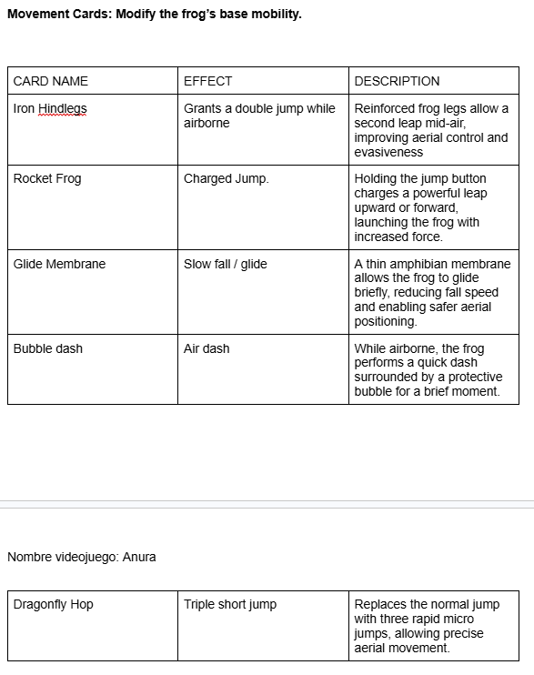
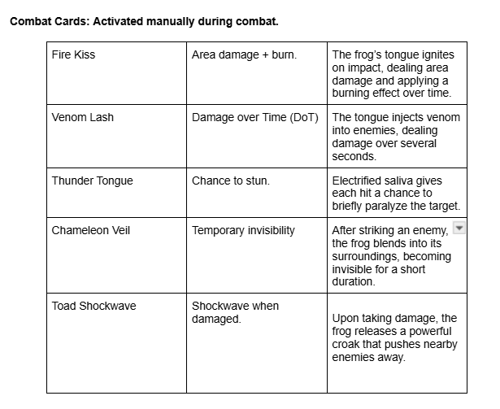
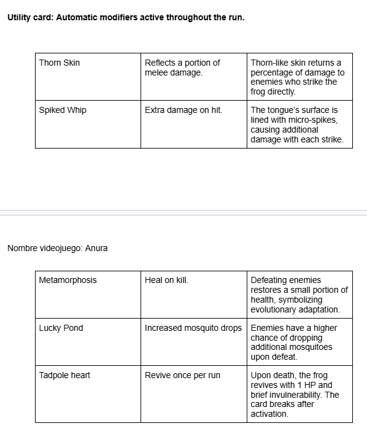
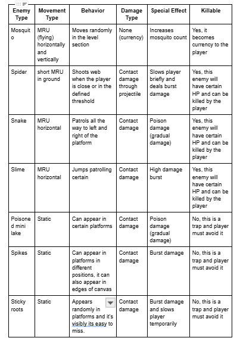
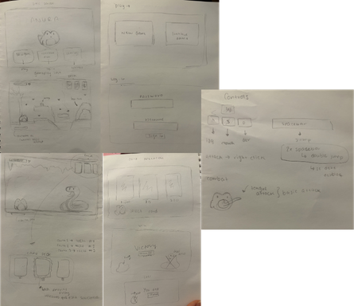

# **Anura**

## _Game Design Document_

---

##### **Copyright notice / author information / boring legal stuff nobody likes**

## _Authors_
* Carlos Enrique Rosete Pascual
* Emilio Torres Castillo
* Renata Uruchurtu Ransom

## _Index_

---

1. [Index](#index)
2. [Game Design](#game-design)
    1. [Summary](#summary)
    2. [Gameplay](#gameplay)
    3. [Mindset](#mindset)
3. [Technical](#technical)
    1. [Screens](#screens)
    2. [Controls](#controls)
    3. [Mechanics](#mechanics)
4. [Level Design](#level-design)
    1. [Themes](#themes)
        1. Ambience
        2. Objects
            1. Ambient
            2. Interactive
        3. Challenges
    2. [Game Flow](#game-flow)
5. [Development](#development)
    1. [Abstract Classes](#abstract-classes--components)
    2. [Derived Classes](#derived-classes--component-compositions)
6. [Graphics](#graphics)
    1. [Style Attributes](#style-attributes)
    2. [Graphics Needed](#graphics-needed)
7. [Sounds/Music](#soundsmusic)
    1. [Style Attributes](#style-attributes-1)
    2. [Sounds Needed](#sounds-needed)
    3. [Music Needed](#music-needed)
8. [Schedule](#schedule)

## _Game Design_

---

### **Summary**

Anura is a 2D roguelite fighting game set in a dangerous swamp. The player controls a small frog fighting its way up the food chain, collecting mosquitoes as persistent currency, building a strategic 3 card deck across runs, and defeating increasingly threatening predator bosses to complete a run.

The game is built in **HTML/JavaScript** using a canvas-based game loop.

### **Gameplay**

The player controls a small frog moving through swamp areas filled with mosquitoes, obstacles, and boss encounters. Mosquitoes act as a currency and are collected using the frog's tongue while navigating platforming sections and preparing for fights.
 
Combat happens in 1v1 boss battles against animals higher in the food chain. Each boss has a unique attack pattern and weakness, encouraging players to experiment with different card combinations and strategies.
 
The player begins their first run with 0 cards and no mosquito currency. Upon dying, a Card Selection Screen appears showing 3 random cards. The player may purchase at most 1 card per death using their accumulated mosquitoes, or skip the selection entirely to keep their current deck unchanged. Cards accumulate across runs in the deck until all the cards are burn. 

Roguelite Structure:

Anura follows a run-based progression system. Each run is self contained, and death resets the current attempt. Mosquitoes function as persistent currency, they are never lost upon death and carry over indefinitely across all runs. Upon dying, the player reaches the Card Selection Screen where they can spend their accumulated mosquitoes to purchase one new card, then start a fresh run.

This creates a classic roguelite loop:

- Attempt run
- Defeat bosses or die
- Earn persistent mosquito currency
- Unlock stronger or more complex cards (max 1 per death)
- Start a new run with improved strategic options

### **Mindset**
 
Anura is built around a strong emotional contrast between calmness and tension.
 
The main mindset can be summarized as:
“Small creature, big world, smart survival.”
 
At the beginning of each run, the player should feel vulnerable and cautious. The frog is small, visually cute and at a first glance quite fragile. When encountering the enemies they seem intimidating in size and presence to the player. This creates tension and a sense of danger.
 
Between boss encounters, platforming sections are designed to feel calm and cozy. The swamp environment is soft and atmospheric even though it still has some obstacles for the player. This peaceful exploration and obstacle course phase reinforces the feeling of safety.
 
However, this calm state is disrupted during boss fights and shifts the player's mentality from relaxed exploration and casual game to tension and alertness. 
 
As the player progresses, learns boss patterns, experiments with card combinations and purchases permanent upgrades, the mindset changes from trying to survive to dominating the game. 
 
The game aims to provoke:
 
- Strategic thinking (not just randomly smashing buttons)
- Tension during boss fights
- Experimentation through card combinations
- Satisfaction from defeating more dangerous bosses
- Resilience through the roguelite loop which would be "failure is progress"
 
Visually, the game supports this whole mindset through a blend of cute, cozy aesthetics and dangerous bosses. The intended emotional experience is for the player to think:
 
"I'm just a cute little frog in a peaceful swamp" right before facing a 1v1 boss fight that forces them to adapt and survive.

## _Technical_

---

### **Screens**

1. Title Screen

    The title screen sets the identity and tone of Anura

    Visually there's:
    The frog sitting peacefully on a lily pad
    Soft swamp ambience in the background
    The game title ANURA in big letters centered

    This screen transmits calmness and charm before the tension of the gameplay

    

    1. Options
    
        Accessible from the Title screen
        Includes:
        
        New game

        Continue Run (if available)
        
        Settings: audio, volume, music on/off (NOTA: SIENTO QUE NO ES TAN ESENCIAL PARA PROPOSITOS DEL PROYECTO POR LO TANTO UNICAMENTE SE DESARROLLARÁ SI HAY TIEMPO SUFICIENTE)
        
        Quit

        

2. Card Selection & Run Prep Screen

This screen appears exclusively after a run ends (death or completion). It manages the initial building of the deck and the transition to the next attempt:

**Step 1: Card Selection & Deck Building**
 **Starting State:** Every new run begins with an empty deck.
 **Selection Process:** Three random cards are displayed along with their mosquito cost. 
 **Acquisition:** The player may purchase a card to add it to their deck pool. Because the new mechanic allows for an unlimited deck size, players are encouraged to accumulate cards of different categories (Combat, Movement, Utility) to ensure their slots remain populated during the run.
 **Skip Option:** The player can choose to skip the selection if they wish to save currency, though they will start the run without that specific advantage.

**Step 2: Deck & Pool Preview**
Once the card decision is made, the screen transitions to a preview of the player's current build:
 **Active Slots:** Displays the cards currently occupying the 3 active slots.
 **Deck Pool:** Shows a summary of the total cards accumulated in the deck that will cycle into the slots as active cards are "burned."
 **Commitment:** A single "Start Run" button launches the new attempt with the curated deck.

*Strategic Note: Since cards are now consumable and randomly replaced from the pool, the selection screen is the primary way to "load up" on resources before facing the platforming sections and Bosses.*
 
    This replaces the original "Level Select" concept — there is no level selection in Anura, as the run structure is fixed (Platform → Boss → Platform → Boss → Final Boss).
 

3. Game
    1. Inventory
    2. Assessment / Next Level
4. End Credits

_(example)_

### **Controls**

How will the player interact with the game? Will they be able to choose the controls? What kind of in-game events are they going to be able to trigger, and how? (e.g. pressing buttons, opening doors, etc.)

The player interacts with the game through direct character control in a 2D side environment. The controls are designed to be simple, supporting fast reactions during boss fights while remaining comfortable throughout the platform sections.

#### **Basic Movement Controls**

- Walk to the right -> D button
- Walk to the left -> A button
- Crouch -> S button
- Jump -> spacebar
- Double jump (if unlocked) -> Press jump (space button) again mid air

#### **Combat controls**
- Basic attack (tongue strike) -> left click button
- Activate card 1 -> #1 button 
- Activate card 2 -> #2 button
- Activate card 3 -> #3 button

Cards are activated manually during combat

#### **Interaction with the environment**
Players can trigger in game events such as:

- Collecting mosquitoes by hitting them with the tongue
- Entering boss arenas by walking through doors or caves
- Navigating obstacles by jumping, dodging or using abilities

#### **Menu and system controls**

- Pause menu -> esc

It will stop the game completly as well as pausing the timer that will exist in each run to indicate the player of its performance in the stadistics section. And the menu will contain the following
->
_Pause menu:_ 
* Resume: it will resume the run where it stopped and the timer will resume its original count and continue.
* Brightness: it will be an option to modify the view of screen.
* Exit: The player will be able to exit the game but the progress they made will not be safed, they to finish the run by either dying or defeating the boss.

### **Mechanics**
 
Anura combines platforming, 1v1 boss combat, and a strategic card activation system within a roguelite progression loop. 
 
The following are the core mechanics and how they function at a systems level.
 
1. Tongue collection and attack system
    
    The frog uses its tongue as both a collection and combat mechanic. (tongue = weapon)
    
    - Mosquitoes are collected then the tongue collider overlaps with their hitbox.
 
    Defining how the currency (mosquitoes) will work:
    - Mosquitoes are collected then the tongue collider overlaps with their hitbox.
 
    - Tongue itself will have a hitbox as well as all the mosquitoes. When these hitboxes interact the counter will increment counter++ and the mosquito will disappear.
 
    - The tongue acts as a short range directional attack, it will funcion as a fast meele hitbox in front of the frog.
 
    need: collision detection system for mosquito collection, hitbox activation during attack animation frames, cooldown timer to prevent spamming.
 
    The tongue attack will be a melee attack that will only depend on the direction the player is looking. This can be right, left and up, and it will have a limited distance so it'll be effective to use short range.
 
    - In terms of physics, we want to implement the movement of the tongue attack as a MRU movement that will stop at a short distance and will always move in “x” direction, we also want to assign these attack the hitpoints that will deal to the boss
 
    - Moving to the spit attack, we want to implement it the same way as the melee attack but the only thing is this movement will not have a limit in distance and it will only stop if it hits the enemy or if its surpasses the frame of what you see in the screen
 
    - Also we need to implement a cooldown on these attacks so it doesn’t become a spam and break the game.
 
    Movement: The character will have 3 types of movement: the regular running (since its 2D it can move sideways only), jumping and a dash.
 
    - Running will be the basic constant movement that the character will have, we will define a certain velocity that fits the pace of the game and it will specifically move in the x axis only. The keybinds “a” (left)  and “d” (right) will be the keys that trigger the move
 
    - Its also defined as a MRU movement only the x axis
 
    - The jump mechanic will be attached to the space bar key and will function a bit more complex than the other mechanics, it will work as a parabolic movement so this means it works as a MRUA and will have an initial velocity in “y” that's a predetermined velocity attached to the space bar and also an initial velocity in “x” that will be attached to the running mechanic. 
 
    - Finally the dash will be a movement that will have cooldowns so it can't be spammed and it will be a faster movement in “x” axis that will give better reaction time to enemies abilities to the player and this dash will have a limited distance reached.
 
 
2. Card System

The card system revolves around three active slots, each assigned to a specific category. While players manage three active cards at a time, they can now build a larger deck that cycles through these slots dynamically.

 Core Mechanics

* **Slot System:** Cards are activated by pressing their assigned key (**1, 2, or 3**). Each slot is dedicated to a specific category (e.g., Combat, Movement, Utility).
* **The Deck:** Players can now accumulate an unlimited number of cards in their deck. These cards sit in a queue behind the three active slots.
* **Burn & Replace:** Cards are single-use. When a card is activated, it is "burned" and removed from the deck. Immediately after, a new card of the same category is randomly pulled from the remaining deck and placed into the active slot.The effects of the card are permantly until the player active another card or die.
* **Sequential Activation:** In all game sections—including **Boss Fights**—cards are activated one by one.The player has the option to activate the 3 slots simultaneously if they want to.

Technical Logic

Each card functions as an ability object with:
* **Effect Value:** (Damage, shield, speed modifier, etc.)
* **Category ID:** Determines which slot (1, 2, or 3) the card populates.
* **Optional Synergy:** Interactions with other active effects.

**Data Structure:**
The deck is managed as a collection of categorized pools:

    slot1_Movement:  [activeCard, reservedCard, reservedCard...],
    slot2_Combat: [activeCard, reservedCard, reservedCard...],
    slot3_Utility: [activeCard, reservedCard, reservedCard...]

**Activation Flow:**

When a key (1, 2, or 3) is pressed:

1. The system checks if a card is available in the slot.
2. The card effect is applied to the player.
3. The active card is **burned** (permanently removed from the deck for that run).
4. A random card from the corresponding category pool is automatically moved to the active slot.
5. Visual feedback triggers to show the new card entering the UI.

---

### Strategic Component

This new system shifts the focus toward **Deck Sustainability and Resource Management**. Since cards are burned upon use, players must strategically decide when to activate a powerful ability versus saving it for a more difficult encounter.

* **Build Diversity:** Players can stack their deck with as many cards as they want, ensuring they have enough "ammo" for their preferred playstyle.
* **RNG Management:** Because the next card in the slot is chosen randomly from the category pool, players must curate a balanced deck to ensure high-quality replacements.
* **Tactical Pacing:** The transition to one-by-one activation (especially in Boss Fights) prevents overwhelming power spikes, requiring the player to find the right rhythm for card usage.

    
    
    

3. Boss pattern system
 
    Boss behavior is driven by structured pattern based logic, implemented through *state management* in JavaScript.
 
    Each boss operates using a *Finite State Machine (FSM) model. This means the boss can only be in one state at a time, and it transitions between states based on predefined conditions such as timers, player distance or remaining health.
 
    Example boss states:
 
    - Idle - the boss waits or prepares an attack.
    - Attack - the boss performs a specific attack animation and activates its hitbox.
    - Recovery - a short vulnerability window afer attacking
    - Phase 2 - activated when health drops below a certain threshold (ex. 50% can vary)
 
    State transitions are controlled using conditional logic an timers. For example:
 
    - Afer a certain time in idle -> transition to attack
    - After Attack completes -> transition to recovery
    - When health is below or 50% -> activate phase 2 behavior
 
    This system ensures predictable but challenging encounters, reinforcing pattern recognition and startegic gameplay instead of complete randomness.
 
    Since the game is built using HTML and JS mechanics are implemented using:
 
    - Game loop logic (e.g., requestAnimationFrame)
 
    - Collision detection systems (hitboxes and bounding boxes)
 
    - State variables
 
    - Timers and cooldown counters
 
    - Health threshold checks
 
    ----------------------------------------------
 
    Thus we will need pure logical programming, so we will need state machine that signifies logic behavior through if, variables, temporizers.
 
    
    A boss pattern system is:
 
    When it currently has a determined state, this could be idle, attacking, recovering and this can be rotated in variables like time, HP.

4. Platform levels
    
    As we will describe further, our game will follow a cycle of having 2 sections levels and each one will have a boss. This means that each section will have platfrom and obstacle levels with enemies you will have to defeat before you reach the boss from the current level.

    Since the game follows a rogue lite mechanic, this means each level has to vary in a way obstacles and enemies are the same but only thing will change in the position in which they appear making every experience of the level different and not something the player can memorize.

    **Elements in levels**

    It is esential to define the 3 types of elements each level will have:
    * Enemies: this type of element will have moving mechanics like moving MRU in "x" position and each enemy will have different mechanics depending on the level. It will be able to damage the player when it detects collision with the player hitbox and the enemy hitbox and it can spawn in random location in the current level available spaces.
    * Traps: this type of element will work as the enemy mechanics but the only thing that changes is that this type of enemy will be static but it will be set in positions where the player could fall and damage himself. 
    * Platforms: this final type of element existing in levels will be the sections in the level that will allow the player to move and finally be able to reach the boss in the level. This means platform will not be able to damage the player and each time the player stays in contact with the platform, he will be able to move on the platform and perform actions to reach other platforms and reach the destination desired. In further levels, we might add moving platforms so it is harder for the player to move.

    **Elements spawn system**

    In the programming of our game we will use the implementation of functions in javascript like randomRange() to ensure that each time the level spawns or generates it spawns in random location. This will apply for each of the type of elements, and we will show a code section as an example to demonstrate the implementation: 

        <!-- addBox() {
        
        const size = randomRange(50, 50);
        
        const posX = randomRange(canvasWidth);
        const posY = randomRange(canvasHeight);
        const box = new GameObject(new Vector(posX, posY), size, size, "grey");
        
        box.destroy = false;
        this.actors.push(box);
        } -->

    This code portion shows a general grasp how we will implement the random generations of elements inside the level. This means we will have a determined canvas size and inside this canvas limits we will generate random elements of random sizes.

    It's also important to mention that depending on each element it will have movement mechanics attached or not.

    **Enemies, platforms, traps**

    Furthermore, its imperative to explain each type of the enemies, platforms, traps that will be described in a chart:

    

### **Themes**

1. Swamp Surface (Initial Zone)
    1. Mood
        1. Calm, humid, cozy, slightly tense, natural and alive
    2. Objects
        1. _Ambient_
            1. Fireflies
            2. lily pads floating
            3. Swamp cane (reeds)
            4. Soft water reflections
            5. Tiny flying insects
            6. Swamp fauna

        2. _Interactive_
            1. Mosquitoes (coin)
            2. Shallow water pools
            3. Mud and moss platforms
            4. Floating logs
            4. boss arena entrance (possibly a cave)

        

2. Dense Swamp (mid game zone): this area reflects progression, the frog is no longer in a safe space, the environment starts to feel more hostile.

    1. Mood
        1. Darker, more enclosed, slightly oppressive, more dangerous, less visually open
    2. Objects
        1. _Ambient_
            1. Thick tree trunks
            2. Large exposed roots
            3. Light mist or fod
            4. Glowing mushrooms
            5. distant predator sounds
        2. _Interactive_
            1. Narrow platforms
            2. Thorny plants (Damage on contact)
            3. Deep water (slows movement)
            2. Unstable logs
            3. MAYBE MINOR ENEMIES (aggressive insects)

            

3. Predator Arena (boss zone)

    1. Mood
        1. Tense, focused, quiet before combat, isolated
    2. Objects
        1. _Ambient_
            1. broken vegetations
            2. bone fragments
            3. Darker water
            4. Heavy shadows
        2. _Interactive_
            1. Boss entity
            2. Arena boundaries (invisible walls or natural barriers)
            3. Terrain elements that influence movement (roots, shallow/deep patches)

         en el 3. roots -> serian como raices que sobresalen del suelo, pueden bloquear el paso, hacer que el jugador tenga que saltar, etc y las shallow deep patches son zonas de agua que reduzcan la velocidad, mas dificil esquivar ataques, etc
    
    Gameplay purpose
    - 1v1 confrontation
    - pattern recognition
    - card strategy execution
    - shift from calm to danger
    - smart survival

        
        
_(example)_

### **Game Flow**

**Run Flow**
1. Title screen: has up to 4 buttons (New Game, Continue Run, Log In, Settings).

    - **New Game:** resets all progress (`currentHealth`, `currentLevel`, `runMosquitos`, `deck`). This is the only option for first time players.
    - **Continue Run:** resumes from the last saved level with the health the player had at the start of that level. `runMosquitos` and `deck` are preserved. Only available if the player has saved progress.
    - **Log In:** allows the user to log in with credentials so their data is saved in the database.
    - **Settings:** turn on/off sounds, brightness, reset progress. (MAY CHANGE)

2. First normal run: player has no cards and no mosquito currency, in this first run the player starts to obtain their first mosquitoes. Player may get to the first boss or die in the platform section.
 
    The run follows this fixed structure:
    - First platform section
    - First boss
    - Second platform section
    - Second boss
    - Final boss (no platform section before it)

2. If player dies at any point of the run a "you died" screen will appear. The player's mosquitoes are preserved.

3. Card Selection Screen (post-death only):
    - Three random cards appear on screen. The player may purchase at most 1 card using their accumulated mosquitoes, or skip the selection. Cards vary in cost depending on their power. The player then chooses to start a new run or return to the main menu.

4. New run: the same run structure is repeated but now the player may or may not have cards depending on their previous runs.
 
    - First platform section 
    - First boss 
    - Second platform section 
    - Second boss 
    - Final boss 
 
5. If player defeats the final boss, a victory screen will appear with a button to return to the menu.

#### Level Structure

The game uses environmental teaching instead of explicit tutorials

Mechanics are introduced naturally:
- Early mosquito placement encourages tongue usage
- Small gaps teach jumping
- Moving platforms teach timing
- Boss teaches pattern recognition

#### Difficulty progression

Boss 1
- Simple attack pattern
- Clear visual signal before excecuting the attack
- Long recovery window

Boss 2 
- Faster attacks
- Shorter recovery window
- Requires better positioning

Final Boss
- Multiple phases
- Combined attack patterns
- Higher tension

Platform sections between bosses gradually increase in:

- Obstacle density
- Precision requirements
- Environmental hazards

The difficulty escalates without introducing entirely new mechanics late in the run. Instead it demands mastery of the existing systems.

#### Post-Death Screen
After dying, the player is taken directly to the Card Selection Screen. This screen shows 3 randomly selected cards with their mosquito cost. The player may:
- Purchase 1 card (if they have enough mosquitoes)
- Skip the selection and keep their current deck unchanged
- Start a new run
- Return to the main menu
 
There is no persistent hub area. Mosquito currency is preserved across all runs regardless of death.

## _Development_

---

### **Abstract Classes / Components**

1. BasePhysics
    1. BasePlayer
    2. BaseEnemy
    3. BaseObject
2. BaseObstacle
3. BaseInteractable

_(example)_

### **Derived Classes / Component Compositions**

1. BasePlayer
    1. PlayerMain(Frog)
2. BaseEnemy
    1. EnemyMosquitoes
    2. Enemyspider
    3. EnemySnake
    4. EnemyBoss1
    5. EnemyBoss2
    6. EnemyFinalBoss
    
3. BaseObject
    1. ObjectCard(Makes a screen for card Selection)
    2. ObjectChest (pick-up-able)
4. BaseObstacle
    1. ObstacleSpike
    2. ObstacleWall
    3. ObstaclePlatform
5. BaseInteractable
    1. InteractableButton
    2. InteractableCards
    3. InteractableCardspot   

_(example)_

## _Graphics_

---

### **Style Attributes**

The visual identity of Anura relies on a high-contrast color palette that reinforces the dual nature of the swamp. For the exploration phases, we will use a "Surface Swamp" palette consisting of mossy greens, earthy browns, and soft turquoise to evoke a calm, humid, and cozy atmosphere. However, as the player enters "Predator Zones," the colors will shift toward saturated deep purples and dark greys to immediately signal danger and heighten tension. By using a limited 16-bit color palette, we ensure that interactive elements remain distinct from the background, maintaining visual clarity even during chaotic boss fights.

The art direction follows a detailed pixel-art aesthetic characterized as "Cute but Deadly." The protagonist, Anura, and the ambient insects will feature soft outlines and rounded shapes to appear charming and vulnerable. In contrast, the predators and bosses will be designed with sharper angles, heavy shadows, and intimidating proportions to establish them as clear threats. To make the world feel alive, we will implement environmental particles such as subtle fireflies and floating lily pads.

Visual feedback is our primary tool for teaching mechanics without lengthy tutorials. To indicate interactivity, mosquitoes will look with a subtle white outline. When a card is activated, Anura will emit a light. During combat, we will use "Flash on Hit" effects and camera shakes to provide tactile weight to every strike, ensuring the player feels the impact of both their successes and their mistakes.

### **Graphics Needed**

1. Characters
    1. Anura Principal Character: frog
    2. Bosses
        - Snake
        - Hawk
    3. Final Boss
        - Fox 
    4. Enemies
        - Slimes
        - Spiders
        - Mosquitoes

2. Environment & Blocks

Tilesets for mud, moss-covered platforms, climbing roots, and hollow logs that serve as transitions between platforming sections and boss arenas.

3. UI & HUD Elements

A clean interface featuring a mosquito counter, a health bar for the frog, and a deck for the three distinct card slots with a visual overlay to indicate cooldown progress.

### **Sounds Needed**

1. Player Effects
        - Wet Step: A squelching sound for walking on mud or moss.
        - Tongue Flick: A fast "thwip" sound for the melee attack.
        - Card Gulp: A satisfying "glug" or eating sound when a card is activated.
        - Dash: A sharp "whoosh" of air to indicate rapid movement.

2. Environmental & Feedback
        - Mosquito Pop: A light, high-pitched "ding" or "pop" upon collection.
        - Water Splash: Different sounds for jumping into shallow vs. deep water.
        - Boss Roar: Low-frequency growls or screeched signals before a boss attacks.
        - Death Croak: A sad, brief vocalization when a run ends.

2. Feedback
    1. Relieved &quot;Ahhhh!&quot; (health)
    2. Shocked &quot;Ooomph!&quot; (attacked)
    3. Happy chime (extra life)
    4. Sad chime (died)

## _Schedule_

1. develop base classes
    1. base entity
        1. base player
        2. base enemy
        3. base block
  2. base app state
        1. game world
        2. menu world
2. develop player and basic block classes
    1. physics / collisions
3. find some smooth controls/physics
4. develop other derived classes
    1. blocks
        1. moving
        2. falling
        3. breaking
        4. cloud
    2. enemies
        1. soldier
        2. rat
        3. etc.
5. design levels
    1. introduce motion/jumping
    2. introduce throwing
    3. mind the pacing, let the player play between lessons
6. design sounds
7. design music

### Card List

**Movement Cards**
- Iron Hindlegs: Grants a double jump while airborne
- Rocket Frog: Charged Jump
- Glide Membrane: Slow fall / glide
- Bubble dash: Air dash
- Dragonfly Hop: Triple short jump

**Combat Cards**
- Fire Kiss: Area damage + burn
- Venom Lash: Damage over time (DoT)
- Thunder Tongue: Chance to stun
- Chamaeleon Veil: Temporary invisibility
- Toad Shockwave: Shockwave when damaged

**Utility Cards**
- Thorn Skin: Reflects a portion of meele damage
- Spiked Whip: Extra damage on hit
- Metamorphosis: Heal on kill
- Lucky Pond: Increased mosquito drops
- Tadpole heart: Revive once per run

### Screens

- Title screen 
    - play screen
    - log in
    - settings
- First platform section screen
- First boss fight section screen
- Second platform section screen
- Second boss fight screen
- Third and final boss fight screen
- Victory/You died screen
- Pause screen
- Card selection screen

### Sketches

